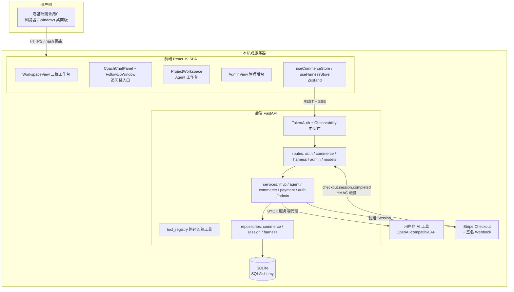
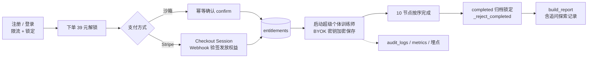
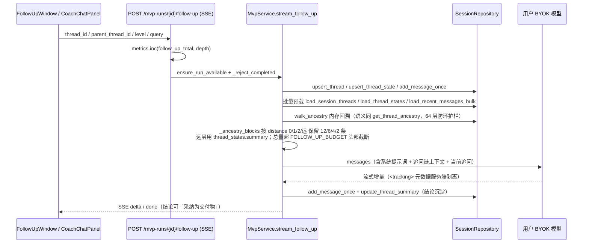
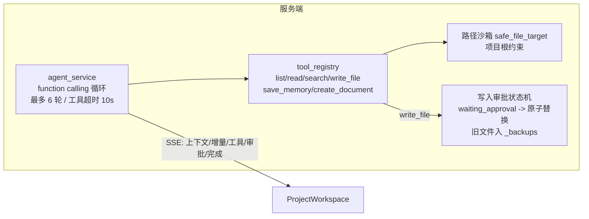
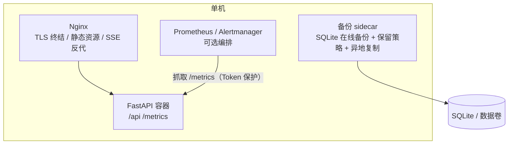

# June AI 架构文档

> 2026-09-10 基于当前代码绘制。配合 `docs/architecture-review.md`（业界对标与改进路线）阅读。

## 1. 系统上下文

## 2. 商业闭环数据流

## 3. 无限追问链（核心机制）

关键不变量（改动前必读 `AGENTS.md` 硬性边界 10-12）：

- 层级、次数无上限；上下文靠「逐层压缩 + 总量封顶」控制，不硬截断、不丢祖先。
- 每次追问结束必须写 `thread_states.summary`；结论可采纳写入当前节点交付物。
- 归档路径拒绝追问与采纳。
- 上下文组装已批量预载（2026-09-10）：链深扩展的查询成本为 0，深链与首层追问同为 ~33 条固定 SQL（`backend/scripts/verify_deep_chain.py` 可复验）。

## 4. Agent 工作台（Harness）

安全边界：无 shell、无删除、无项目外写入；trace 中 `write_file` 只记路径/字节数/SHA-256，完整内容放 `_pending` 短期快照，批准/拒绝/取消后清理。

## 5. 部署拓扑

状态：本机 Nginx + 自签 HTTPS 演练已通过；Docker 生产编排代码就绪未实跑；真实域名证书与真实 Stripe 密钥未接入。
